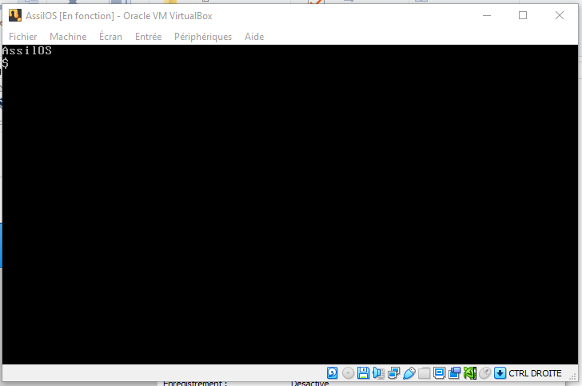

# AssilOS (Codenamed Aurès) 💾

AssilOS is monolithc boot-sector operating system that based on bootOS, is it not linux-based.

### license
AssilOS is released under BSD 2-Clause license, you can modify, sell, redistribute under BSD 2-Clause terms, see [License](LICENSE).

### screenshot

### requirements
- linux distros/BSD/macOS/windows
- CSM enabled
- QEMU (recommanded)
- virtualbox (opetional)
- DOSBox-X (optional)
- NASM assembler

### Can it run bootOS programs and bootOS games?
- yes!, it can run programs or games because AssilOS is based on bootOS, you can get them from [nanochess](https://github.com/nanochess/)
- also, you can create your own programs or games (they must fit to 512-bytes!) 
- avoid use DOS programs, as they won't fit into 512-bytes

### rules

- you can: study, modify, distribute AssilOS (with requirements), use it in commercial products, use it for retro computing.
- you cannot: remove copyright notice of nanochess, claim as your own, use it for illegal actions.

### build instruction
nasm -f bin os.asm -l os.lst -o os.img
